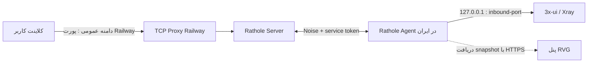

# راهنمای استقرار Rathole با Railway و 3x-ui

## هدف و محدوده

این راهنما جریان جدید پنل RVG را برای انتشار **TCP inbound**‌های 3x-ui از یک نود ایران، از مسیر Railway و Rathole شرح می‌دهد. در این طراحی، پنل فقط «وضعیت مطلوب» را نگه می‌دارد؛ عامل نصب‌شده روی نود ایران تنظیمات Rathole را دریافت می‌کند و ترافیک کاربردی از مسیر دادهٔ Rathole عبور می‌کند. Rathole برای عبور از NAT طراحی شده و هر سرویس با یک token مستقل روی سرور و کلاینت تعریف می‌شود.[1]

> منظور از «بدون نشت IP» در این معماری این است که برای استفاده از سرویس منتشرشده، **نیازی به باز کردن پورت ورودی روی نود ایران نیست** و endpoint کلاینت، hostname و پورت TCP Proxy در Railway یا CNAME آن است. این امر جایگزین تنظیم درست فایروال، DNS، outbound و TLS در 3x-ui نمی‌شود و هیچ سامانه‌ای نمی‌تواند بدون بررسی این اجزا «عدم نشت مطلق» را تضمین کند.

| بخش | وظیفه | سطح دسترسی شبکه |
|---|---|---|
| پنل RVG در Railway | مدیریت نود، ساخت TCP Proxy، نگه‌داری تنظیمات و API عامل | HTTP(S) پنل و TCP کنترل Rathole |
| Rathole Server در Railway | دریافت اتصال خروجی نود و bind کردن سرویس‌های منتشرشده | کنترل و یک یا چند پورت داخلی سرویس |
| TCP Proxy Railway | ارائهٔ hostname و پورت عمومی برای هر پورت داخلی | ورودی عمومی TCP |
| Rathole Agent در ایران | دریافت تنظیمات از پنل و ایجاد اتصال خروجی به Railway | فقط اتصال خروجی به پنل و Railway |
| 3x-ui / Xray روی نود ایران | سرویس محلی مقصد، معمولاً روی `127.0.0.1:<inbound-port>` | فقط loopback توصیه می‌شود |

## تغییرات پیاده‌سازی‌شده

نسخهٔ فعلی چهار مشکل عملیاتی مهم را رفع می‌کند. نخست، ترابرد پیش‌فرض Rathole از TCP ساده به **Noise** تغییر کرده است. Noise در Rathole با الگوی پیش‌فرض `Noise_NK_25519_ChaChaPoly_BLAKE2s`، سرور را برای عامل اعتبارسنجی می‌کند و نیاز به ساخت گواهی self-signed ندارد.[2] کلید خصوصی X25519 فقط در state پایدار Railway نگه‌داری و در `server.toml` تزریق می‌شود؛ عامل ایران تنها کلید عمومی را از snapshot احراز هویت‌شده دریافت می‌کند.

دوم، تولیدکنندهٔ `server.toml` اکنون state بارگذاری‌شده از volume را به‌صورت زنده می‌خواند. بنابراین نودها و تونل‌هایی که بعد از start برنامه ساخته می‌شوند واقعاً در پیکربندی Rathole سرور ظاهر می‌شوند. سوم، سازگاری نسخهٔ عامل بررسی می‌شود: فعال‌کردن Noise برای عامل‌های گزارش‌شده با نسخهٔ پایین‌تر از `2.2` رد می‌شود تا اتصال آن‌ها ناگهان قطع نشود. چهارم، لینک‌های VLESS، Trojan و Shadowsocks هنگام اتصال به تونل، **hostname و پورت واقعی TCP Proxy Railway** را دریافت می‌کنند؛ دیگر پورت `443` به‌اشتباه hard-code نمی‌شود.

| کنترل امنیتی | پیاده‌سازی فعلی | اثر مورد انتظار |
|---|---|---|
| رمزنگاری مسیر Railway ↔ ایران | Rathole Noise با کلید X25519 پایدار | جلوگیری از مشاهده و جعل مسیر داده در این بخش |
| احراز هویت سرویس | token تصادفی و مستقل برای هر tunnel | جداسازی سرویس‌های مختلف روی یک نود |
| احراز هویت عامل | token امضاشده و قابل چرخش برای هر node | جلوگیری از دریافت snapshot توسط عامل ناشناس |
| سطح حملهٔ نود ایران | عامل فقط اتصال خروجی می‌سازد | عدم نیاز به پورت مدیریتی ورودی روی نود |
| انتشار endpoint | TCP Proxy Railway برای هر tunnel | جداشدن endpoint عمومی از آدرس نود ایران |

## پیش‌نیازهای Railway

روی Railway باید سرویس از `Dockerfile` موجود build شود و یک Volume روی `/data` متصل باشد. state کنترل‌پلین، کلید خصوصی Noise، tokenهای tunnel و metadata مربوط به TCP Proxy در این volume نگه‌داری می‌شوند؛ بدون volume، redeploy می‌تواند سبب تولید کلید جدید و قطع اتصال عامل‌های فعال شود.

Railway برای TCP Proxy یک hostname و **یک پورت خارجی اختصاصی** تولید می‌کند و ترافیک `domain:port` را به پورت داخلی سرویس می‌فرستد.[3] در نتیجه، باید پورت اعلام‌شده توسط Railway را در URLهای کلاینت حفظ کرد. اگر از دامنهٔ شخصی استفاده می‌شود، فقط hostname با CNAME جایگزین می‌شود و پورت Railway همچنان اجباری است. Cloudflare در این حالت باید روی **DNS only / خاکستری** باشد، نه proxied.[3]

```dotenv
# Railway Variables
DATA_DIR=/data
RATHOLE_ENABLE_SERVER=1
RATHOLE_SERVER_PORT=23333
RATHOLE_PUBLIC_PORT=443
RATHOLE_LOG=info

# مقدار SECRET_KEY را با یک مقدار بلند، تصادفی و پایدار تنظیم کنید.
SECRET_KEY=<long-random-secret>
```

پنل اکنون به‌صورت پیش‌فرض در حالت **بدون توکن** کار می‌کند. شما TCP Proxy را در داشبورد Railway می‌سازید و فقط `hostname:port` آن را در کارت «اتصال دو سرور» پنل ثبت می‌کنید؛ پس از آن نود ایران به endpoint ثبت‌شده وصل می‌شود و عملیات روزانهٔ تونل به Railway API Token نیاز ندارد. حالت خودکار با **Railway Account یا Workspace API Token** همچنان اختیاری است. در صورت استفاده از آن، توکن با permission `0600` در volume پایدار `/data` ذخیره می‌شود و هرگز به مرورگر بازگردانده نمی‌شود. برای استقرار immutable می‌توان متغیر `RAILWAY_API_TOKEN` یا `RAILWAY_TOKEN` را در Railway تنظیم کرد. توکن را هرگز داخل repository، اسکریپت نصب نود یا لینک subscription قرار ندهید.

## راه‌اندازی نود 3x-ui در ایران

ابتدا در 3x-ui یک inbound برای پروتکل مورد نظر بسازید. برای سناریوی استاندارد VLESS/Trojan با WebSocket یا XHTTP، سرویس را روی `127.0.0.1` و پورت inbound انتخابی bind کنید. گواهی TLS و SNI باید با **دامنهٔ عمومی داخل Config** سازگار باشند، زیرا Rathole TCP را شفاف عبور می‌دهد و TLS را terminate نمی‌کند.

سپس در صفحهٔ «تانلینگ» پنل، مسیر زیر را انجام دهید:

1. در Railway Dashboard و روی سرویس همین پنل، یک TCP Proxy برای پورت داخلی کنترل Rathole (پیش‌فرض `23333`) بسازید. Railway یک `hostname:port` برمی‌گرداند.
2. در ابتدای صفحهٔ «تانلینگ»، روش «بدون توکن — TCP Proxy دستی Railway» را نگه دارید، `hostname` و `port` مرحلهٔ قبل را در «اتصال دو سرور» وارد و دکمهٔ «ثبت اتصال دو سرور» را بزنید. badge باید «دو سرور متصل‌اند» شود.
3. یک «نود ایران» بسازید و **فرمان نصب جدید** را روی سرور ایران با کاربر دارای `sudo` اجرا کنید. عامل نسخهٔ `2.2` را نصب می‌کند و endpoint کنترل ثبت‌شده را دریافت می‌کند.
4. منتظر بمانید تا heartbeat نود، وضعیت آنلاین و عامل فعال را نشان دهد.
5. در «تنظیمات Rathole»، گزینهٔ **Noise (رمزنگاری)** را انتخاب و ذخیره کنید.
6. برای هر inbound که می‌خواهید منتشر شود، در Railway یک TCP Proxy دیگر برای «پورت پیش‌فرض» انتخاب‌شده در پنل بسازید. `hostname:port` آن را در بخش «TCP Proxy سرویس» فرم وارد کنید.
7. سپس یک کانفیگ/لینک مربوط به inbound 3x-ui انتخاب کنید. `آدرس سرویس روی ایران` را `127.0.0.1` و `پورت محلی سرویس` را دقیقاً برابر پورت inbound قرار دهید.
8. در «دامنهٔ عمومی داخل Config»، دامنه‌ای را وارد کنید که certificate آن در Xray/3x-ui نصب شده است. اگر دامنه ندارید، این فیلد را خالی بگذارید تا hostname TCP Proxy Railway در لینک قرار گیرد.
9. «انتشار پورت و ساخت تانل» را بزنید. پنل endpoint دستی واردشده را داخل کانفیگ client ثبت می‌کند و از Railway API Token استفاده نمی‌کند.
10. اگر دامنهٔ شخصی وارد کرده‌اید، CNAME آن را به `proxy_domain` نمایش‌داده‌شده در کارت tunnel بگذارید و آن رکورد را DNS-only نگه دارید. سپس با دکمهٔ Ping، `دامنه:پورت` نهایی را بررسی کنید.

> Rathole به‌صورت پیش‌فرض TCP را همان‌طور که دریافت می‌کند forward می‌کند؛ فعال‌سازی Noise فقط لایهٔ Railway تا نود ایران را رمزگذاری و سمت سرور را برای عامل authenticate می‌کند.[2] TLS مربوط به VLESS/Trojan همچنان انتها‌به‌انتها بین کلاینت و Xray باقی می‌ماند.

## مسیرهای داده و کنترل



نود ایران هیچ اتصال ورودی جدیدی برای مدیریت Rathole نمی‌پذیرد. عامل از داخل ایران به کنترل‌پلین HTTPS و endpoint کنترل Rathole در Railway متصل می‌شود. برای حفظ این ویژگی، موارد زیر را جداگانه کنترل کنید:

| مورد | تنظیم پیشنهادی |
|---|---|
| فایروال نود ایران | inbound مدیریتی Rathole باز نشود؛ فقط SSH مدیریت‌شده و ترافیک خروجی لازم مجاز باشد. |
| bind سرویس 3x-ui | برای سرویس اختصاصی tunnel از `127.0.0.1` استفاده شود، مگر دلیل عملیاتی روشنی برای bind خارجی وجود داشته باشد. |
| DNS دامنهٔ عمومی | فقط به Railway TCP Proxy/CNAME اشاره کند؛ رکورد A/AAAA مستقیم به IP نود ایران نسازید. |
| Cloudflare | روی CNAME مربوط به TCP Proxy حالت DNS-only باشد؛ proxy نارنجی برای raw TCP مناسب نیست.[3] |
| خروجی 3x-ui | outbound و DNS Xray را مطابق policy خودتان بررسی کنید؛ مقصد نهایی معمولاً IP خروجی همان نود ایران را می‌بیند، نه IP Railway. |
| لاگ و secrets | `RATHOLE_LOG=info` یا `warn`، محدودیت دسترسی به `/data` و عدم ثبت token در لاگ‌های خارجی. |

## ارتقا، بازیابی و عیب‌یابی

اگر نودهای قبلی عامل `2.1` یا قدیمی‌تر دارند، پیش از انتخاب Noise در پنل، برای هر نود فرمان نصب جدید را مجدداً دریافت و اجرا کنید. پنل در صورت مشاهدهٔ عامل ناسازگار، تغییر ترابرد را با پیام مشخص رد می‌کند. پس از redeploy، نودها باید به‌دلیل volume پایدار، همان کلید عمومی Noise و همان tokenهای سرویس را دریافت کنند.

اگر tunnel آنلاین نمی‌شود، ابتدا به‌ترتیب وضعیت «control proxy»، heartbeat نود، `rvg-rathole` و `rvg-rathole-agent` را روی نود بررسی کنید. بعد از آن مطابقت `local_port` با inbound واقعی 3x-ui و CNAME/پورت Railway را بررسی کنید. Railway صراحتاً اعلام می‌کند که در دامنهٔ سفارشی، CNAME فقط hostname را تغییر می‌دهد و باید همان پورت تخصیص‌داده‌شدهٔ TCP Proxy استفاده شود.[3]

```bash
# روی نود ایران
sudo systemctl status rvg-rathole rvg-rathole-agent --no-pager
sudo journalctl -u rvg-rathole -u rvg-rathole-agent -n 150 --no-pager
sudo cat /opt/rvg-rathole/client.toml
```

## محدودیت‌های مهم

این پروژه برای **فوروارد TCP** سرویس‌های 3x-ui طراحی شده است. Railway TCP Proxy پورت خارجی را اختصاص می‌دهد؛ بنابراین «رزرو تضمینی 443 روی دامنهٔ شخصی» با CNAME ساده قابل فرض نیست. اگر محصول شما الزام قطعی برای پورت خارجی ثابت `443`، UDP گسترده، چندین ingress با پورت‌های از پیش تعیین‌شده یا کنترل کامل فایروال دارد، به یک لایهٔ edge یا سرور با IP ثابت خارج از این محدودیت Railway نیاز خواهد بود.

همچنین fieldهای «Origin مرجع» و «بررسی سلامت» در پنل فقط metadata و Ping نگه می‌دارند؛ آن‌ها مسیر دادهٔ Rathole را به یک upstream خارجی redirect نمی‌کنند. مسیر واقعی همیشه `TCP Proxy Railway → Rathole Server → Rathole Agent → local_host:local_port` است.

## منابع

[1]: https://github.com/rathole-org/rathole "Rathole — README و پیکربندی سرویس‌ها"
[2]: https://github.com/rathole-org/rathole/blob/main/docs/transport.md "Rathole — Transport Security و Noise Protocol"
[3]: https://docs.railway.com/networking/tcp-proxy "Railway — TCP Proxy"
